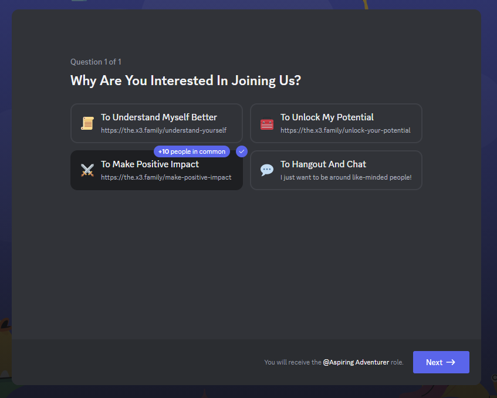

## What Is An Adventurer?

When we think about helping others, typically we imagine high-commitment engagements like volunteering at a soup kitchen, animal shelter, or local church. At the Co-x3 Family Foundation, we want to change the game, by gamifying positive contributions to the world. We want to make it easy for you to apply yourself and your unique skillset towards meaningful one-off or occasional tasks to support our programs helping people live better lives.

## Why Be An Adventurer?

Your contributions, regardless of their size, are immensely valuable to us. Whether you have a few minutes or several hours, there's a place for you here. Participation in even small, one-off tasks can make a significant impact.

## What Benefits Do I Get As An Adventurer?

Adventurers get access to unique gear to help them fulfill their mission, which can be used for personal endeavors as well. This includes free access to productivity tools, automation platforms, and much more.

When you complete tasks, you'll be rewarded publicly and build up stats within the community. If you ever need to share your experience with prospective employers, you'll get a profile with your specific contributions, so they know exactly how you've been helping out the community.

High-performing adventurers may also be offered [collaborator](/make-positive-impact/collaborators) roles in the community, opening up opportunities to turn their passions into full-time careers.

## How Can I Be An Adventurer?

### Step 1: Aspiring Adventurer

1. Join our [community](https://our.x3.family).
2. In the onboarding steps, indicate that you want to make positive impact and you will be assigned a role!

3. You'll be contacted by an active adventurer in the community to identify your talents.
4. Be assigned a quest from the [recurring quest list](#recurring-quests) that fits your skillset and passions!

### Step 2: Choose Your Roles

1. Once you've fulfilled your quest, you'll have the chance to take the Adventurer's test to determine your roles. Your role will determine what kind of quests would be most suitable for you, and the gear that you need.

_You can change your roles throughout your time as an adventurer!_

<ExpandableCard title="Strategist 🧠" eventCategory="/make-positive-impact/contribute/be-an-adventurer" eventName="clicked strategist" contentPreview="The Brain - Defines direction, sets goals, and crafts strategic plans.">

- Excels in understanding the bigger picture and making informed decisions.
- Skilled in critical thinking, data analysis, and forecasting.
- Focuses on planning, analysis, and information gathering.

</ExpandableCard>

<ExpandableCard title="Innovator ❤️" eventCategory="/make-positive-impact/contribute/be-an-adventurer" eventName="clicked innovator" contentPreview="The Heart - Pushes boundaries, experiments, and comes up with creative solutions.">

- Thrives in environments that need novel solutions, new ideas, unique approaches.
- Adept at brainstorming, experimentation, and identifying trends or patterns.
- Centered around creativity, invention, and out-of-the-box thinking.

</ExpandableCard>

<ExpandableCard title="Attacker 👟" eventCategory="/make-positive-impact/contribute/be-an-adventurer" eventName="clicked attacker" contentPreview="The Legs  - Focuses on achievement of goals, drives growth and expansion.">

- Highly effective at solving problems, overcoming obstacles, or achieving goals.
- Possesses specialized skills or knowledge, making them the go-to person.
- Inspiring or motivating to others through their determination and drive.

</ExpandableCard>

<ExpandableCard title="Defender 💪" eventCategory="/make-positive-impact/contribute/be-an-adventurer" eventName="clicked defender" contentPreview="The Arms - Manages daily operations, ensures reliability and dependability.">

- Reliable and dependable, often serving as the foundation or backbone of a team.
- Endures difficult or challenging situations, acting as a stabilizing force for others.
- Has strong leadership qualities or the ability to guide and protect others.

</ExpandableCard>

<ExpandableCard title="Supporter 🏡" eventCategory="/make-positive-impact/contribute/be-an-adventurer" eventName="clicked supporter" contentPreview="The Skeleton - Builds the team, fosters culture, and enhances team performance.">

- Enhances abilities and performance of others via guidance, motivation, resources.
- Identifies and addresses weaknesses or problems within a team or system.
- Often has a broad knowledge or skillset, allowing them to adapt easily.

</ExpandableCard>

<ExpandableCard title="Connector 🩸" eventCategory="/make-positive-impact/contribute/be-an-adventurer" eventName="clicked connector" contentPreview="The Blood - Builds partnerships, secures resources, and connects people and ideas.">

- Skilled at networking, relationship-building, and creating collaborations.
- Excels in connecting people, resources, and ideas.
- Has strong interpersonal skills and a talent for identifying synergies.

</ExpandableCard>

2. Once you pass the test, you'll get the Adventurer role and be announced in our monthly newsletter.
3. Every adventurer starts at a ⭐ rank, and you'll rank up as you complete more quests.

### Step 3: Active Adventurer

1. Check out the [Quest Board](https://discordapp.com/channels/653664936903573504/1214593232475004988) to pick up unique quests that suit your role and rank or pick up recurring quests.
2. Get your [Contributor Resources](https://discordapp.com/channels/653664936903573504/1227984441167712360) like free productivity tools, etc.
2. Do one quest a month to maintain your active adventurer status and keep your benefits!

## Recurring Quests

Here are some of the recurring quests that you might be assigned to! We've categorized them by perspectives in the [Better Life Framework](/understand-yourself/better-life-framework) because holding certain perspectives help you succeed more in certain quests.

| Perspective        | Task                               | Description                                           | Difficulty        |
|--------------|------------------------------------|-------------------------------------------------------|-------------------|
| All   | Share Feedback                     | Provide your thoughts and suggestions.                | ⭐                |
|              | Like and Subscribe                 | Support us on social platforms.                       | ⭐               |
| 3+     | Post In Community Channels         | Engage in community discussions.                      | ⭐               |
|              | Bug Identification                 | Identify and report website issues.                   | ⭐               |
|              | Translation Services               | Help translate our content.                           | ⭐⭐             |
|              | Join As A Podcast Guest           | Join our podcast and share your perspective shifts     | ⭐⭐             |
| 4+     | Suggest Knowledge                  | Add insights to our knowledge base.                   | ⭐               |
|              | [Improve Glossary Terms](/make-positive-impact/contribute/be-an-adventurer/glossary)             | Add or edit glossary terms.                            | ⭐               |
|              | Share On Social Media              | Promote us on social media.                           | ⭐               |
|              | Design Contributions       | Improve our website design.                           | ⭐⭐⭐           |
|              | Host Local Meetups                 | Organize meetups for comrades.                        | ⭐⭐             |
| 5+     | Suggest Tools                      | Recommend personal growth tools.                      | ⭐               |
|              | Tool Improvement             | Add enhancements to our existing tools.                   | ⭐⭐             |
|              | [Quiz Management](/make-positive-impact/contribute/be-an-adventurer/quizzes)                      | Create quizzes for the Co-x3 Foundation.              | ⭐⭐             |
| 6+     | Suggest Experiences      | Lead self-awareness initiatives that you would enjoy.                          | ⭐⭐⭐           |
| 8+     | Submit Research                    | Contribute to community research papers.              | ⭐⭐⭐           |
| 9+     | Ambassador Program                 | Be our ambassador at events and social gatherings.    | ⭐⭐⭐           |

_Any questions?_ 🤔 Reach out in our [community](https://our.x3.family/)