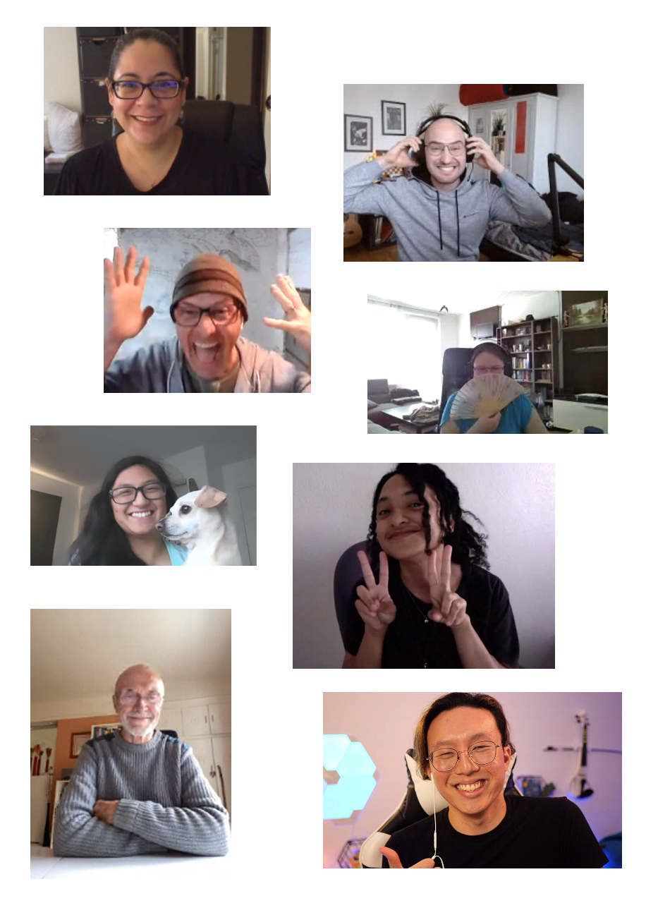

## Why Support?

We envision a world where everyone, regardless of their financial background, has the opportunity to grow, learn, and excel.The Co-x3 Family is a supportive community where members uplift and strengthen each other.

Everyone needs support at some point. Whether it's due to financial constraints or other challenges, we want our scholarship to be a beacon of hope and a catalyst for positive change. Your contribution as a supporter is not just financial assistance - it's a gesture of kindness and solidarity, enabling someone to embark on a journey of personal development.

[Donate Now](https://donate.stripe.com/7sI5njeq364L5Ww9AA)

## Who Should Support? 

Supporting our cause should be a comfortable decision for you. We encourage contributions only if they don't lead to any financial strain on your part.

If you're someone who values kindness, desires to make a positive difference, wishes to give back to the community, or seeks to be part of something larger than yourself, then supporting the Co-x3 Family is an ideal way for you to contribute.

[Donate Now](https://donate.stripe.com/7sI5njeq364L5Ww9AA)

## What Is The Impact?

At Co-x3, we believe in making a significant impact in people's lives by offering them opportunities to grow, learn, and succeed. While 80% of our resources are freely accessible, our premium programs, which constitute the remaining 20%, are crucial for accelerating in-depth development and personal growth.

Your support as a donor goes beyond just funding; it's about opening doors for those who are ready to walk through them but are held back by financial constraints. Your contribution ensures equitable access to our life-changing programs, making a direct impact on individuals' journeys towards self-improvement and empowerment.

[Donate Now](https://donate.stripe.com/7sI5njeq364L5Ww9AA)

## The Co-x3 Family Scholarship

For every $100 donated, you empower 10 individuals with 30 days of the [Co-x3 Subscription](/make-positive-impact/contribute/subscription), offering them a wealth of resources for personal growth.

As a supporter, you’ll receive regular updates, sharing the progress and achievements of the individuals you’ve helped. We also offer tiered benefits for regular supporters, recognizing and thanking you for your ongoing commitment.

All donations are tax-deductible, ensuring that your generosity is also beneficial for you.

[Donate Now](https://donate.stripe.com/7sI5njeq364L5Ww9AA)

*If you'd like to make a donation over $10,000 USD, please [contact our team](mailto:donations@x3.family) for bank wire instructions.*

---

<InfoBanner shouldCenter emoji=":pray:">
  "I can say without a doubt that it was the best decision of my year to learn about Co-x3 and benefit from the subscription. The resources that are provided are out of this world, and I am loving leveling up with the community." - Israel Parreira
</InfoBanner>

---

## Looking To Apply For The Scholarship?

If you're driven to grow but face financial barriers, the Co-x3 Family Scholarship is your opportunity to leap forward. We seek passionate individuals who demonstrate a commitment to personal growth and a desire for positive change. Our application process is transparent and focuses on your dedication and potential.

Every month, our community comes together to select the individuals who will benefit from the scholarship that period. They'll be able to view your application and vote accordingly - so make friends in the community!

[Apply Now](mailto:support@x3.family)

