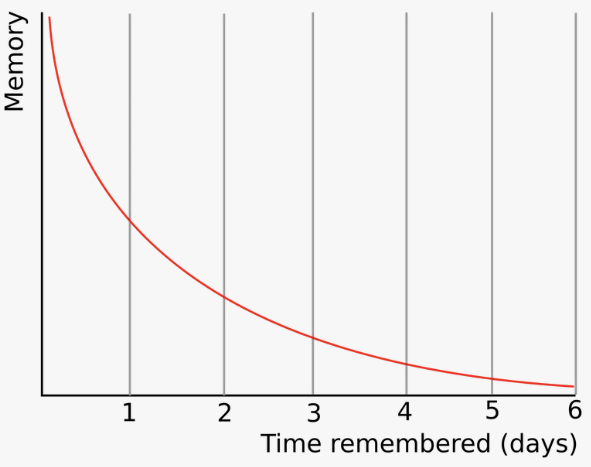

## Introduction

We’ve all felt the frustration of forgetting something important—whether it's an insightful idea we wanted to act on or a concept we recently studied. Forgetting isn’t a personal shortcoming; it’s an inherent part of how our brains function. 

In this article, we’ll dive into why we forget and explore actionable techniques to effectively retain and apply knowledge.

## Prerequisites

This principle will resonate with you if you've experienced any of the following:  

- Struggled to recall information shortly after learning it.  
- Felt frustrated by forgetting concepts you once knew well.  
- Wanted to improve your ability to retain knowledge and apply it effectively.

## What Is the Forgetting Curve?

Our brains are designed to prioritize information that is regularly used or considered important. While this helps conserve mental energy, it also means that details we don’t revisit tend to fade quickly.

The forgetting curve, coined by psychologist Hermann Ebbinghaus in the late 19th century, demonstrates how quickly memory retention declines and the factors that affect our memory. 

### Focus  

Distractions like multitasking, mental stress, or constant notifications disrupt the brain’s ability to consolidate new memories. This fragmentation makes it harder to retain information in the long term.  

### Repetition  

When information isn’t revisited, it fades rapidly from memory. For example, studies show that within 24 hours, you may forget up to 50% of what you’ve learned. Revisiting material strengthens neural connections, ensuring more reliable recall.  

### Relevance  

Information tied to strong emotions, personal experiences, or practical applications tends to stick better. Lessons that relate to real-world scenarios are more memorable than abstract concepts.

## How to Overcome the Forgetting Curve

Here are some practical ways to apply this principle:

### 1. **The Feynman Technique**  

Known as “The Great Explainer,” Richard Feynman, a Nobel Prize-winning physicist, believed that understanding was only complete when you could explain an idea simply and clearly. His technique helps uncover gaps in knowledge and ensures a deeper grasp of the material.  

- **Recollection**: Immediately after learning something, spend 30–60 seconds recalling it from memory. Avoid referring to notes and test how much you truly understand.  
- **Reiteration**: Explain the concept to someone else or write it down. Simplify the material using analogies, acronyms, or chunking techniques to make it more digestible.  
- **Simplify**: Break down jargon and attempt to "Explain Like I’m 5" (ELI5). This forces you to clarify your thoughts and confirm your mastery of the topic.  

### 2. **Spaced Repetition**  

Spaced repetition is a memory-boosting technique that involves reviewing material at strategically spaced intervals. By revisiting information just as you’re about to forget it, this method solidifies knowledge in your long-term memory.  

- **Set Up Q&A for Yourself**: Use flashcards or tools like Anki to create a question-and-answer format for material you want to remember.  
- **Follow a Review Schedule**: Start with short intervals (e.g., Day 1, Day 3) and gradually extend them (Day 7, Day 14). Revisiting material at these critical times strengthens memory pathways and makes recall effortless.  

### 3. **Turn Knowledge Into Action**  

When you apply what you learn, it gains concrete utility rather than being just an abstract idea.  

- **Relate It to Other Concepts**: Connect the material to something you already know to create a stronger mental network.  
- **Use It in Real Life**: Apply the knowledge to tasks, assignments, or discussions. For instance, integrate a new idea into a project or teach it to others.  
- **Reflect Regularly**: Document how you’ve applied the knowledge and analyze its impact. Periodic reviews reinforce understanding and help refine your approach.  

## Related Programs  

This principle is especially relevant to **Perspective 4: Belonging**, where we aim to make the knowledge we absorb meaningful and actionable.  

<ButtonLink to="/unlock-your-potential/programs?filters=LEVEL_4">Explore Programs related to 4: Belonging</ButtonLink>  

### Notable Mentions  

- [Be Intentional](/unlock-your-potential/programs/be-intentional): This program helps you create your own personal knowledge management system with these strategies built in, ensuring useful information is retained and applied effectively.  

## References and Further Reading  

1. [Replication and Analysis of Ebbinghaus’ Forgetting Curve](https://pmc.ncbi.nlm.nih.gov/articles/PMC4492928/): A paper replicating Ebbinghaus’ classic forgetting curve from 1880 based on the method of savings.
2. [The Feynman Technique: The Best Way to Learn Anything](https://fs.blog/feynman-technique/): A comprehensive article by Farnam Street on how the Feynman Technique works and why it’s so effective for deep learning.  