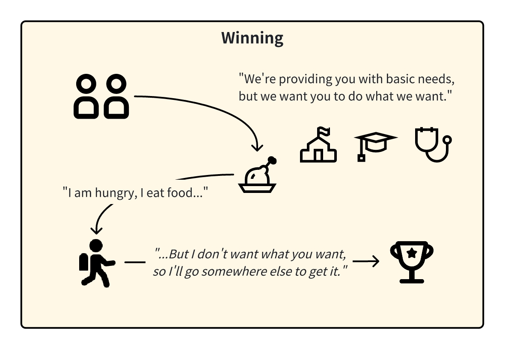
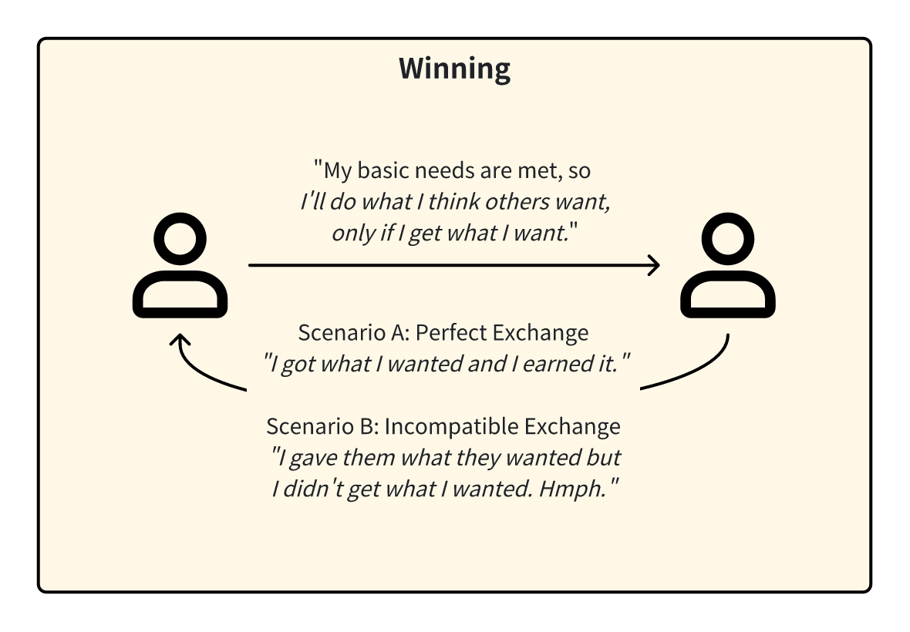

<InfoBanner shouldCenter emoji=":bulb:">
  Whether you're exploring this perspective to understand yourself better or to empathize with someone else's viewpoint, this guide is here to help. Remember, this perspective is just one way of looking at the world, and it's normal for us or others to experience it at different times in our lives. Think of this as a window into how we or they might be thinking and feeling.
</InfoBanner>

## Introduction

Imagine a world where everyone is the main character of their own story, where happily ever after means getting everything that you want in life. That's kind of what life feels like from the 'Winning' perspective. 

It's like being in a big, exciting game where the goal is to look out for ourselves and make the best moves to win. We believe that we need to be our own heroes, and even when others help us, we see it as a win for us.

## How This Perspective Develops

We start feeling this way when our basic needs – like food and a safe place to live – are taken care of. Then we begin to think about what more we want from life.

When we are in the ['Dependency' perspective](/unlock-your-potential/programs/guide-2), we learn that we can get what we need when we interact with others. So, when we develop our wants, it comes with the expectation that our caretakers are also responsible for our wants.

We shift into the 'Winning' perspective when we realize that the people who give us what we need might have their wants that don't align with ours. We recognize that we have to be there for ourselves and get what we want from other people instead.

## Historical Context

The 'Winning' perspective can be linked back to mythic, feudal, and exploitative empires that emerged around 10,000 years ago. This era was characterized by a social structure where the pursuit of personal ambitions and desires was paramount. 

The primary focus was on doing what one wants, taking what one desires, and getting one's way by any means necessary. It was an age where climbing the ranks of power was the mentality of many. Individuals sought to exert their will and influence over others to achieve their objectives. 

## Modern Context

We still see the 'Winning' perspective prevailing in the modern day. We live in a world where we are constantly pressured to consume, to chase our wants, and the idea of a good life is marketed to be one of material wealth.

In the workplace, we often use language like "winning the sale", or "beating the competition". We're often benchmarked against our colleagues, and we get sucked into the rat race.

## Strengths and Challenges

In the 'Winning' perspective, we start experimenting and developing ways to approach interactions to get what we want in the world. Our strength is in thinking about what we want and how to get it from others.

The behaviors we exhibit largely depend on our experiences.

| Behaviour | How It Develops | Impact on Outcomes |
|-----------|-----------------|--------------------------------------|
| **Giving** | Development often stems from early experiences of empathy and compassion, reinforced by positive feedback when helping others. A nurturing environment that values altruism and community can also encourage this behavior. | Givers prioritize the needs of others and often provide support without expecting anything in return. This selfless approach can foster trust, cooperation, and a strong sense of community. However, if not balanced, it might lead to burnout or being taken advantage of. |
| **Taking** | This behavior can develop in highly competitive environments where resources are perceived as scarce, or where individual achievement is emphasized over communal well-being. Past experiences of resource scarcity or neglect might also contribute. | Takers focus primarily on their own needs and interests. They often try to gain as much as possible from their interactions with others while contributing little in return. This approach can lead to short-term gains but may damage trust and long-term relationships, potentially leading to isolation and conflict. |
| **Matching** | Matching behavior often arises from social norms and a desire for equity and fairness. It can be influenced by societal or cultural values that emphasize balance and reciprocal relationships, as well as personal experiences that reward equivalent exchange. | Matchers operate on a principle of fairness and reciprocity. They tend to balance giving and taking, ensuring that their relationships are mutually beneficial. This approach promotes equality and sustainability in relationships but might lack the spontaneity and selflessness seen in givers, leading to transactional interactions. |

No matter which of the 3 behaviors we manifest, a challenge that we face is being let down when others don't give us what we want, and difficulties dealing with people who operate differently than us (eg. givers vs takers).

As we're new to discovering our wants, we also can be influenced by wants that are marketed to us. We often get confused about what we really want, or if its what society tells us we should want.

## Unlock Your Potential

We can live better lives when we think of life like a game. We can try to collect points and build up our skills. Focus on internal reward metrics versus external ones, because it's easier to feel accomplished when the scoreboard is your own.

Establish what game you're playing so that you can be clear about what you want from each situation, and don't waste time on pursuits that don't satisfy your wants.

<ButtonLink to="/unlock-your-potential/programs?filters=LEVEL_3">Check Out Programs For 3: Winning</ButtonLink>

## Is It Time To Level Up?

If you're getting what you want, that's awesome! You might start wondering, though, if there's more to life. Maybe you're looking for more meaning, or you find that being part of a group makes life better. If that's how you feel, exploring the ['Belonging' perspective](/unlock-your-potential/programs/guide-4) might be your next step.

If things aren't going your way, don't worry. Sometimes, trying to do everything alone doesn't work out. In these times, finding like-minded people can be the key to success. The ['Belonging' perspective](/unlock-your-potential/programs/guide-4) can also help here.