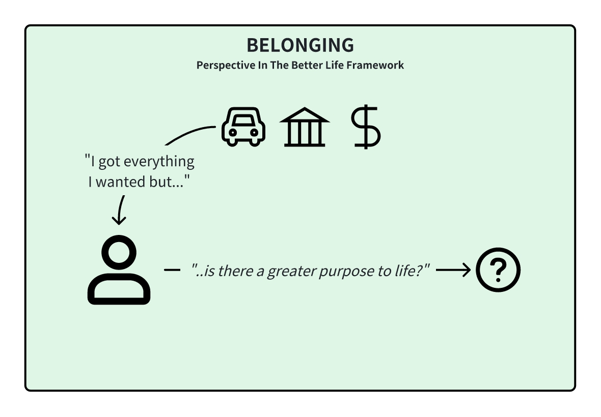
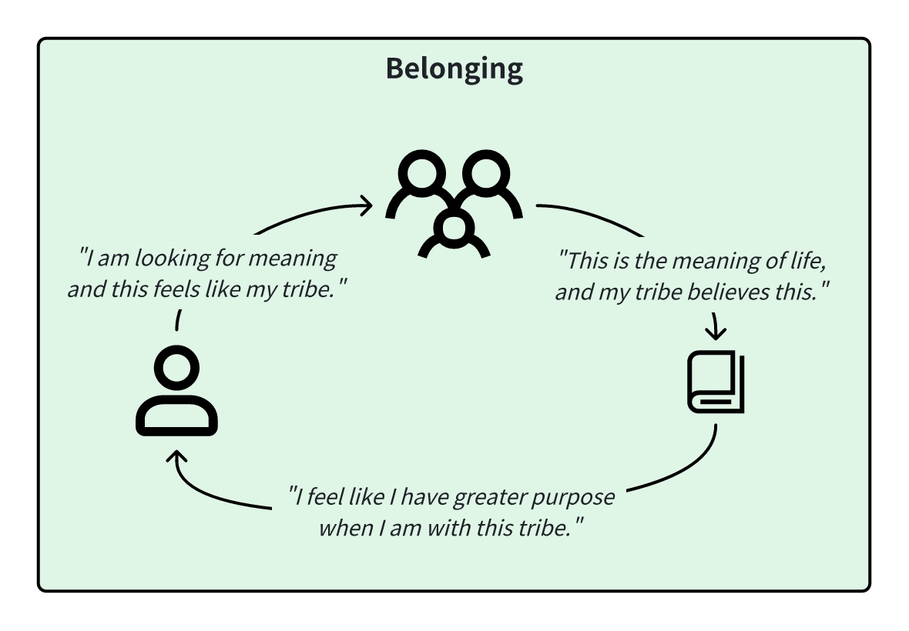
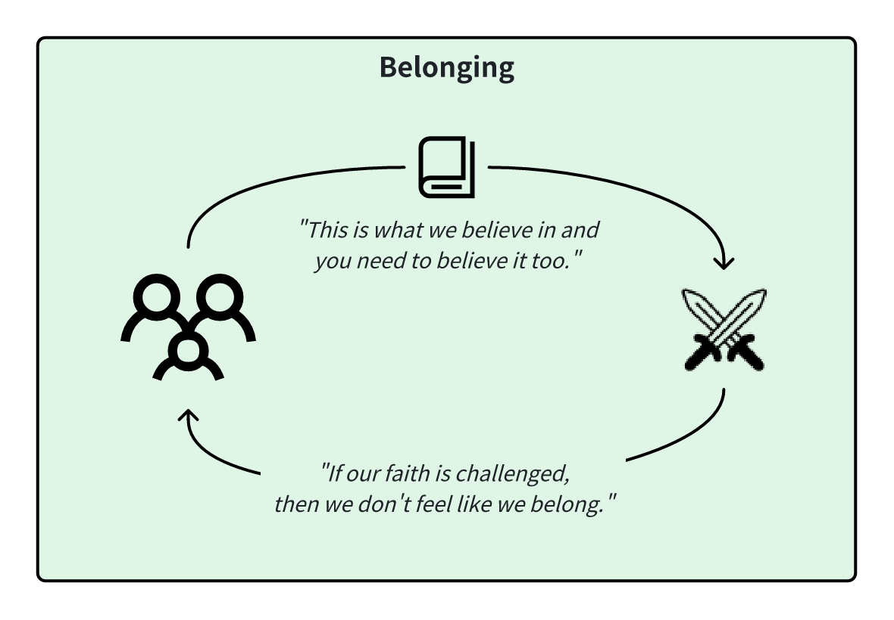

<InfoBanner shouldCenter emoji=":bulb:">
  Whether you're exploring this perspective to understand yourself better or to empathize with someone else's viewpoint, this guide is here to help. Remember, this perspective is just one way of looking at the world, and it's normal for us or others to experience it at different times in our lives. Think of this as a window into how we or they might be thinking and feeling.
</InfoBanner>

## Introduction

The 'Belonging' perspective centers on the idea that life is not just about our individual experiences but about being part of something bigger. It's where we find meaning in shared values and beliefs, understanding what's good and bad, and striving to do the right thing for the common good. This perspective emphasizes ensuring others also adhere to these shared principles and values.

## How This Perspective Develops

The 'Belonging' perspective evolves when we realize that individual actions and selfishness can lead to discord, or when we find a community that helps us get what we want. It emerges from the understanding that following agreed-upon rules and standards is vital for maintaining harmony and order. This perspective is nurtured by the belief that collective well-being hinges on everyone doing their part and upholding shared values.

## Historical Context

The historical roots of the 'Belonging' perspective can be traced to late mythic empires, nation-states, and religious orders, around 5,000 years old. During these times, the focus was on finding purpose, direction, and ultimate meaning. People believed in doing what was right to achieve good outcomes, with a goal of finding or earning ultimate peace, and winning the battle of good versus evil.

Methods included strict adherence to rules, not stepping out of line, and controlling oneself and others through faith and discipline. This era also witnessed pathologies like over-identification with roles, fundamentalism, and fascism, reflecting the intense commitment to shared beliefs and practices.

## Strengths and Challenges

A key strength of this perspective is the commitment to shared values and a sense of purpose, which fosters a strong community bond and a clear sense of direction.

However, it can also lead to challenges such as rigidity, intolerance towards different viewpoints, and over-conformity, where individuality and personal expression may be suppressed for the sake of group cohesion.

## Unlock Your Potential

To be your best self in this perspective, focus on finding your why and your meaning in life. Find groups to join that resonate with you, and can help you live a remarkably better life. Religions groups can enrich your life, but always try to keep an open mind to ensure you are getting what you want from the experience.

## Is It Time To Level Up?

If you're getting what you want from your community, then congratulations! However, if you do find that there are some group values you just can't agree with, it may be time for you to embrace a ['Systems' perspective](/unlock-your-potential/programs/guide-5) where you build your own rules to follow that help you achieve what you want.

You may also not find a community that gives you what you want. Thus, it may be good for you to study other ways of living in different cultures and apply a ['Systems' perspective](/unlock-your-potential/programs/guide-5) to build the life that you want.