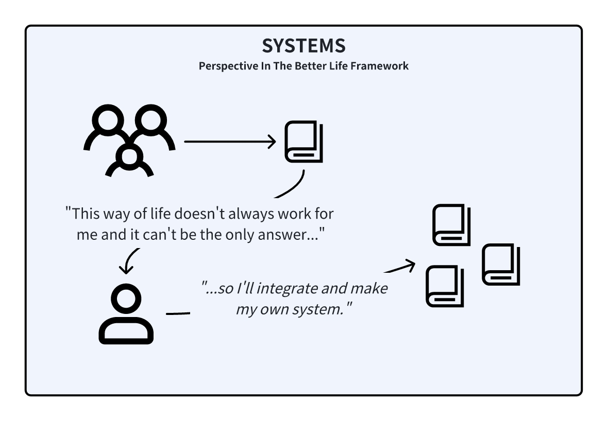
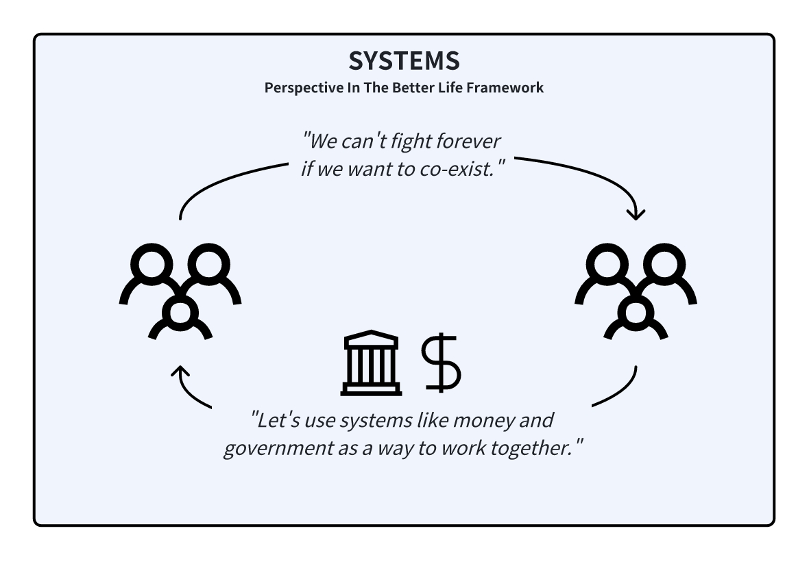
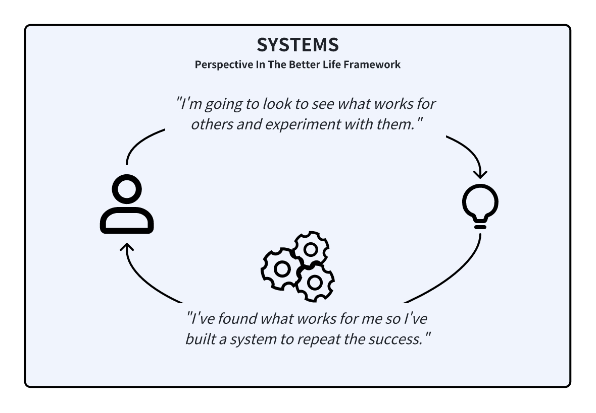

<InfoBanner shouldCenter emoji=":bulb:">
  Whether you're exploring this perspective to understand yourself better or to empathize with someone else's viewpoint, this guide is here to help. Remember, this perspective is just one way of looking at the world, and it's normal for us or others to experience it at different times in our lives. Think of this as a window into how we or they might be thinking and feeling.
</InfoBanner>

## Introduction

In the 'Systems' perspective, we come to realize that what is 'good' and 'bad' varies from person to person, and from one culture to another. What benefits us might not benefit someone else. We believe in making decisions based on facts and analysis to achieve the outcomes that are best for us and our community.

This perspective isn't about being forced into a life of service but about understanding how to make positive things happen, keep the benefits, and always strive for improvement.

## How This Perspective Develops

When we are in the ['Belonging' perspective](/unlock-your-potential/programs/guide-4) and find the social groups that we want to associate with, we focus on us versus them mentality. However, if we encounter some similarities we can't ignore, we may start recognizing that the other side isn't so different from us after all. 

We develop the 'Systems' perspective when we start seeing the complexities and diversities in people’s needs and desires. It's about moving from a simple black-and-white view of the world to recognizing the gray areas. We rely on logic, measurement, and proof to navigate these complexities, aiming to make informed decisions that benefit both ourselves and those around us.

## Historical Context

The roots of the 'Systems' perspective can be traced back to the beginnings of capitalist democracies and market-driven meritocracies around the 1600s. This era was characterized by a focus on scientific reasoning, logical thought, and a view of life as a strategic multiplayer game.

The goals of the game were material wealth, the defense of civilization, and continuous improvement and growth. Then, success was defined by the achievement of measurable objectives and the tangible impacts of one's actions.  

## Modern Context

In the modern day, we see the 'Systems' perspective in organizations. Companies exist because they have created a process to make money and create SOPs (standard operating procedures) to ensure the organization can continue to run even with a change in people or management. However, this also has the downside of turning the majority of the workforce into cogs in the system, endlessly spinning to keep the economic machine running.

## Strengths and Challenges

Our strength in this perspective lies in our ability to set clear goals and use strategic planning to achieve them. This logical approach leads to tangible results and continuous improvement.

However, we sometimes face challenges when our systems fail or when situations require an emotional or intuitive response. Our focus on efficiency and results can lead to frustration in unpredictable circumstances and might overshadow the importance of emotional intelligence and relationships.

## Unlock Your Potential

To be your best self in this perspective, build systems to manage every aspect of your life, so you can learn from your experiences - good and bad. Try to automate as much as you can, but be aware that we cannot automate human emotions or relationships.

<ButtonLink to="/unlock-your-potential/programs?filters=LEVEL_5">Check Out Programs For 5: Systems</ButtonLink>

## Is It Time To Level Up?

If you're finding success with your systems, that's great. But if you encounter situations where your systems fall short, it might signal a readiness for the ['Letting Go' perspective](/unlock-your-potential/programs/guide-6), where you will learn how to not be so reliant on your systems.

You might also not be having great success in building your own systems. In this case, moving to the ['Belonging' perspective](/unlock-your-potential/programs/guide-4) may help you learn how others are implementing systems in their communities, and you can build your foundation from them.