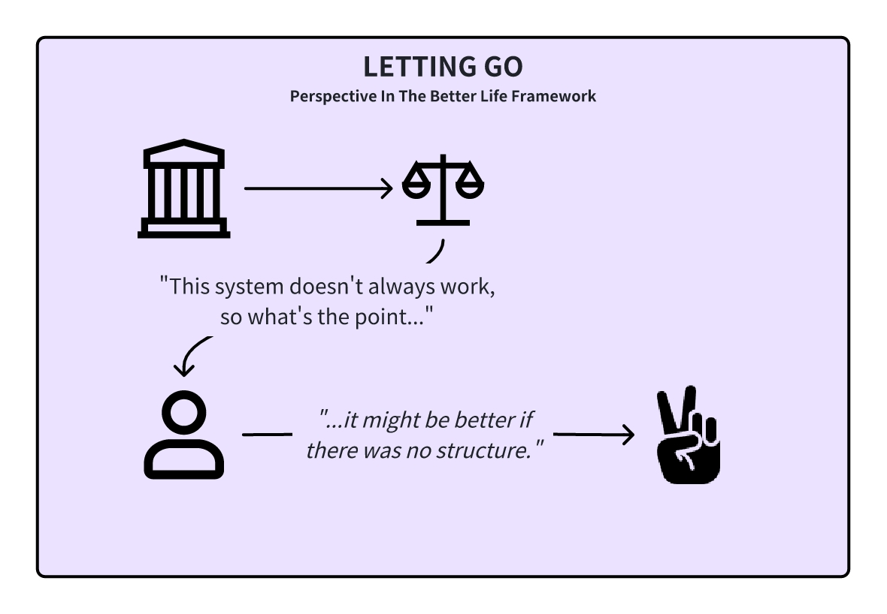
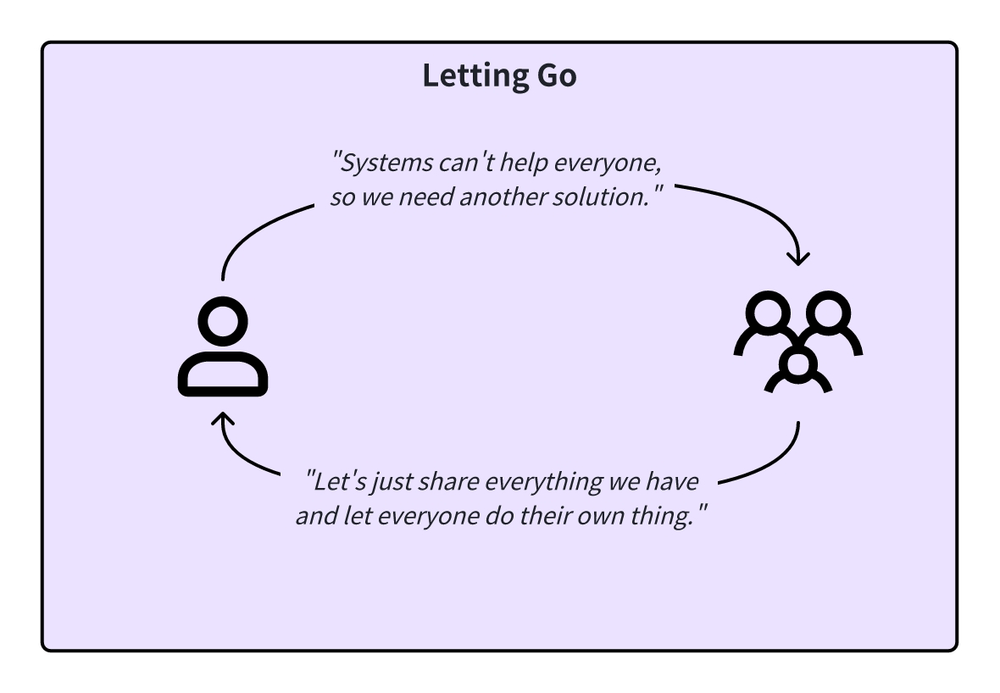
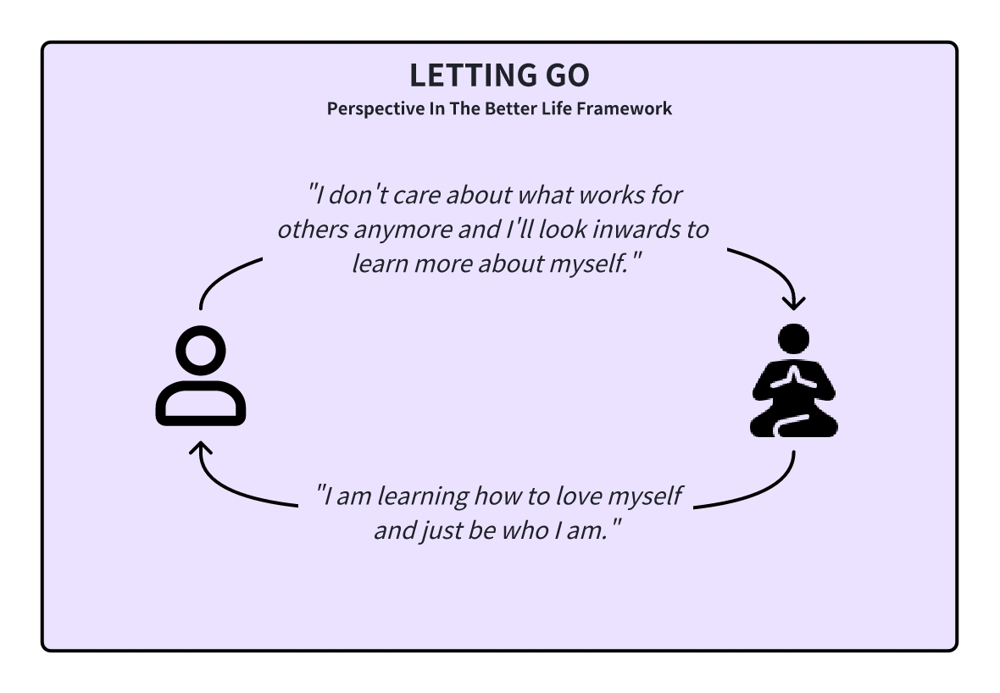

<InfoBanner shouldCenter emoji=":bulb:">
  Whether you're exploring this perspective to understand yourself better or to empathize with someone else's viewpoint, this guide is here to help. Remember, this perspective is just one way of looking at the world, and it's normal for us or others to experience it at different times in our lives. Think of this as a window into how we or they might be thinking and feeling.
</InfoBanner>

## Introduction

The 'Letting Go' perspective is all about valuing each person's uniqueness and advocating for the freedom to live authentically. We challenge the conventional rules and structures of society that often restrict genuine self-expression.

We believe in the importance of individual experiences, where no one should impose their views on others. We envision a world of peace and acceptance, where differences are not just tolerated but celebrated.

## How This Perspective Develops

When we are in the ['Systems' perspective](/unlock-your-potential/programs/guide-5), we have a strong belief that systems can solve every problem in the world. As long as there is a best practice and the structure is clear, everyone will get a fair and equitable result. 

However, as we experience a more global society, we start to realize that people are perhaps a lot more different than we imagine, and traditional rules and systems may not always accommodate the diverse needs and desires of individuals. It's a realization that diversity is not a deviation but a natural part of human life. We understand that freedom and respect for individual choices are essential for a harmonious society.

The 'Letting Go' perspective typically develops when we feel that systems have failed us, and as a reaction, give up on all forms of systems to look beyond structure.

## Historical Context

The 'Letting Go' perspective has its roots in social democracies, beginning in the 1800s. This era saw a shift towards inner peace, the expansion of care for others, and the advocacy of human rights. It was marked by a mentality of radical inclusiveness, aiming for consensus, effective communication, and mutually beneficial relations.

The methods were inclusive, giving voice to the powerless, emphasizing group needs, and working to eliminate marginalization. However, this period also witnessed challenges such as inauthenticity, lack of discernment, overemphasis on consensus, and sometimes narcissistic behaviors.

## Modern Context

In the modern day, more and more people are getting disillusioned with achieving success in the workplace. This can happen because of a lack of upward mobility, conflict with personal values, and other grievances with the system.

When this happens, we opt to leave the capitalistic societies that permeate our lives and quit our jobs, some even moving to cheaper countries like Thailand, Indonesia, etc. to live a simpler life. To reconnect with ourselves, we take up mindfulness practices such as yoga, meditation, breathwork, etc.

## Strengths and Challenges

Our strength in this perspective lies in our commitment to inclusiveness and respect for individuality. We strive for a world where diverse views are heard, and everyone's rights are respected. We tend to look within for answers, getting in touch with our inner selves and learning to love ourselves.

However, we can face challenges in maintaining authenticity and discernment. Our desire for consensus and inclusiveness can sometimes lead to overlooking practical realities and the need for effective decision-making. There's a risk of becoming so focused on group needs that we neglect personal accountability and clear direction.

## Unlock Your Potential

To be your best self in this perspective, it's crucial to embrace mindfulness and self-reflection. It's been a long time since we listened to ourselves, and it's time to pay attention to what our inner selves are saying. Freely let go of rigid systems and expectations and find your path through introspection.

<ButtonLink to="/unlock-your-potential/programs?filters=LEVEL_6">Check Out Programs For 6: Letting Go</ButtonLink>

## Is It Time To Level Up?

In this perspective, it's easy to accidentally be too inclusive and forego our boundaries, leaving us feeling raw and used. If you're feeling this way, the ['Setting Boundaries' perspective](/unlock-your-potential/programs/guide-7) might be your next step.

However, if you are not financially secure, setting boundaries can be difficult. It may be better to temporarily think from a ['Systems' perspective](/unlock-your-potential/programs/guide-5) to ensure you can sustain yourself so you don't have to bend to others' will to secure your wants and can walk away when necessary.