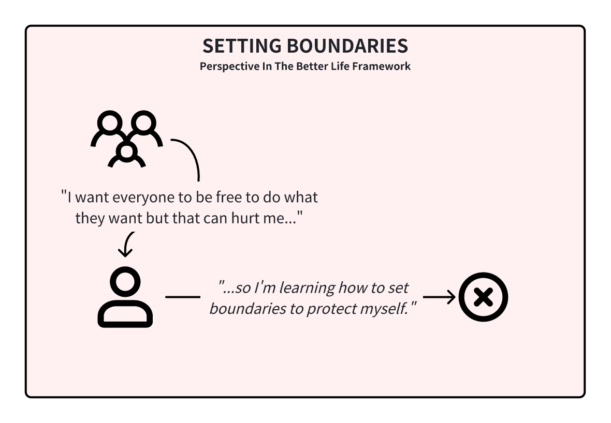
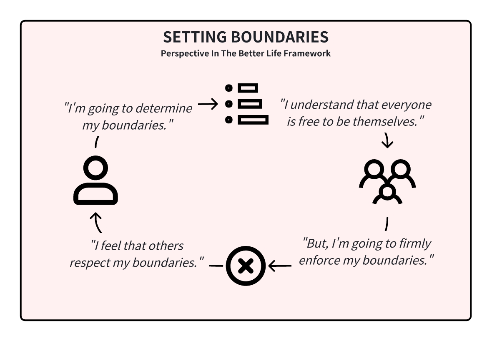

<InfoBanner shouldCenter emoji=":bulb:">
  Whether you're exploring this perspective to understand yourself better or to empathize with someone else's viewpoint, this guide is here to help. Remember, this perspective is just one way of looking at the world, and it's normal for us or others to experience it at different times in our lives. Think of this as a window into how we or they might be thinking and feeling.
</InfoBanner>

## Introduction

In the 'Setting Boundaries' perspective, we value who we are and what we care about while navigating the complexities of human interactions. We champion the freedom of individual expression but also acknowledge the necessity of boundaries for personal well-being.

As we change and grow, so do our boundaries, reflecting our evolving needs and beliefs. Setting boundaries is an act of self-respect and wisdom, ensuring that our interactions are sustainable and that we occasionally say 'no' as an affirmation of our values.

## How This Perspective Develops

We cultivate this perspective as we mature in our understanding that respect for individual freedom includes protecting our own space and peace. We learn to discern our limits, from our basic dislikes to our absolute deal-breakers, and communicate them effectively.

It is when we find ourselves in positions of power that we truly shine in this perspective, as we find that our boundaries are being respected.

## Historical Context

The 'Setting Boundaries' perspective gained prominence in the world-centered social web of the mid-1900s, a period focused on authentic self-expression and the harmonization of internal and external worlds.

This era encouraged us to develop our innate potential while acknowledging the collective needs, yet it also confronted us with the challenges of realizing our full selves, navigating existential dilemmas, and the dangers of superficial conformity.

## Modern Context

In the modern day, we can see societal boundaries being set by the government in the form of laws. Criminals who break rules that are set by the government are placed in prisons.

In relationships with a power imbalance, it's tremendously difficult for individuals to exert their boundaries, so we see a rise in third-party institutions that attempt to give power back to the victims.

## Strengths and Challenges

Our primary strength lies in our ability to identify and honor our boundaries while understanding others' individualistic tendencies. This builds self-respect and earns the respect of others.

Conversely, our challenge is managing relationships where our boundaries are tested or not recognized, leading to potential conflicts and the need to uphold our principles firmly without alienating those important to us.

## Unlock Your Potential

To be your best self in this perspective, learn to set and respect boundaries that foster your well-being and growth. It's about understanding ourselves to the fullest and encouraging others to do the same, finding harmony that benefits ourselves and the broader community.

## Is It Time To Level Up?

If you find yourself frustrated by those who struggle to respect your boundaries, especially those close to you, consider exploring the ['Curiosity' perspective](/unlock-your-potential/programs/guide-8). This shift can provide the patience and understanding needed to navigate complex personal dynamics.

If you're not ready to understand their perspective, consider going to the ['Letting Go' perspective](/unlock-your-potential/programs/guide-6), instead.