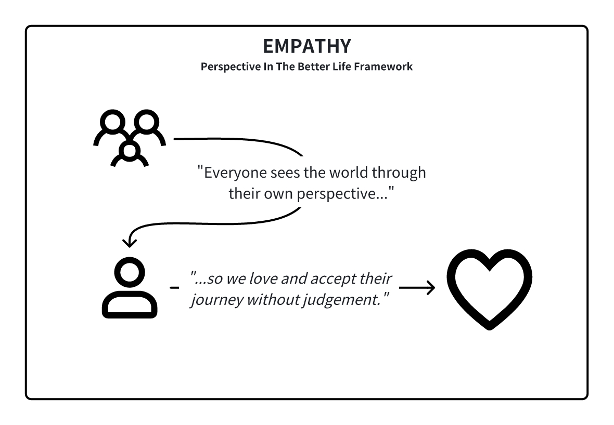
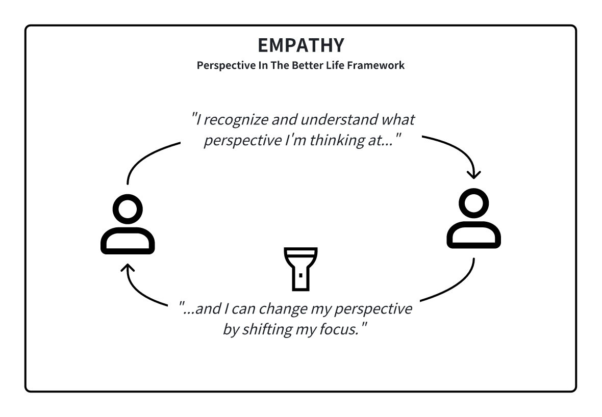

<InfoBanner shouldCenter emoji=":bulb:">
  Whether you're exploring this perspective to understand yourself better or to empathize with someone else's viewpoint, this guide is here to help. Remember, this perspective is just one way of looking at the world, and it's normal for us or others to experience it at different times in our lives. Think of this as a window into how we or they might be thinking and feeling.
</InfoBanner>

## Introduction

In the 'Empathy' perspective, we recognize that the world is too complex to control, and life is not a game but an intricate show. We understand that we can't always predict outcomes, but we can approach each other with empathy and a willingness to understand. Every gesture and action is part of our shared humanity, and by observing and learning from each other, we cultivate a world that shines brighter with understanding and compassion.

## How This Perspective Develops

When we are in the ['Curiosity' perspective](/unlock-your-potential/programs/guide-8), we start developing a recognition of life's unpredictability and the unique experiences that shape each of us. It's a realization that while we may set out with intentions and care, the outcome can be unpredictable. We learn to let go of rigid expectations of how people might think and embrace the fluidity of life, understanding that we are all constantly evolving and learning from our experiences.

## Historical Context

In a world that's rapidly changing, where social structures are still forming and the collective consciousness is expanding, the 'Empathy' perspective is becoming ever more relevant. It describes a future where the focus is on observing and understanding the vast ecology of human experiences, honoring and protecting all beings and phenomena without the need to control or respond with judgment.

## Modern Context

In the modern day, we would identify this perspective as one of enlightenment and unconditional love. Very few people in history have reliable access to this perspective, and we typically hear about it only in scriptures or when we reference certain saints. The truth of the matter is that we are all human, and it is human to perceive the world from different perspectives.

## Strengths and Challenges

Our strength is our ability to love and accept people where they are, offering support without trying to change their essence. This perspective fosters deep connections and a profound understanding of the human condition. We are able to see the different perspectives we view the world and understand how our perspective (and reality) can shift depending on where we place our focus.

Our challenge is to maintain this depth of empathy without losing ourselves or becoming overwhelmed by the emotional weight of the world. We must learn to shine our light without dimming our own.

## Unlock Your Potential

To be your best self in the 'Empathy' perspective, deepen your understanding of others and cultivate an unconditional love that transcends individual journeys. We strive to protect our inner peace while offering our light to illuminate the paths of those around us. The best way to do so is to love all the perspectives we experience and let them pass without judgment.

<ButtonLink to="/unlock-your-potential/programs?filters=LEVEL_9">Check Out Programs For 9: Empathy</ButtonLink>

## Is It Time To Level Up?

When you find joy in the simple act of understanding and empathizing with others, you embody the 'Empathy' perspective. However, we can't always stay in this perspective, because ultimately there will be situations where we have more emotional triggers or attachments. In such cases, be aware of the perspective you approach the situation, and gradually raise your awareness when you're ready.